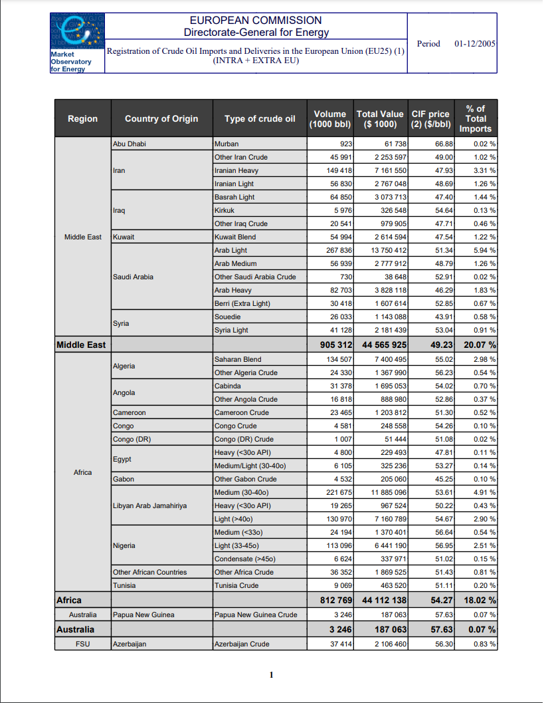

```{r setup, include=FALSE}
knitr::opts_chunk$set(echo = TRUE)
library(tidyverse)
```

## Project Details

This project is a complicated PDF scraping project I undertook to advance my data cleaning skills.

The data we're interested in is stored in PDF tables.

The documents currently look like this:



The data now looks like this:

```{r}
readr::read_csv("00_data/crude_imports_by_month_year_country_type_of_crude.csv") %>% 
    head(10) %>% 
    knitr::kable()
```

What made this project especially challenging is the inconsistent presentation of data from PDF - PDF and the very large amount of missing values in many of the cells. See the pdf_scraping_scratchpad/ for an insight into just how complex this undertaking was.

But with advanced use of regular expressions and tidyverse functions the data is extracted to a very high degree of accuracy. 


